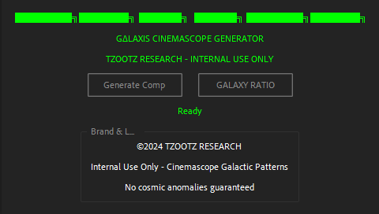

# TZOOTZ RESEARCH - GΔLAXIS CINEMASCOPE v2.0

**Golden Ratio Cinemascope Generator for After Effects**  
Welcome to the **TZOOTZ RESEARCH - GΔLAXIS CINEMASCOPE v2.0**, a powerful tool designed to bring precision, aesthetics, and creativity to your After Effects compositions. Leverage the elegance of the Golden Ratio and rule-of-thirds segmentation to create stunning, mathematically consistent designs.

---



## ✨ Features

- **Advanced Segmentation**: Utilizes the Golden Ratio (φ) and two-thirds rule to generate precise vertical and horizontal divisions.
- **Dynamic Polygons**: Automatically creates randomized polygons (triangles or other shapes) from intersection points, ensuring mathematical harmony.
- **Interactive Workflow**: Regenerate shapes and lines with the "GALAXY RATIO" button for instant creative iteration.
- **Aesthetic Focus**: Designed to occupy 85% of the composition for maximum visual balance.

---

## 🔧 Installation and Usage

1. **Download the Script**:
   Save the `TZOOTZ_GALAXIS_CINEMASCOPE.jsx` file in your After Effects Scripts folder.

2. **Launch in After Effects**:
   - Open After Effects.
   - Navigate to **File > Scripts > Run Script File**.
   - Select the `TZOOTZ_GALAXIS_CINEMASCOPE.jsx` file.

3. **Create and Customize**:
   - Use the **Generate Comp** button to create a new composition with perfect Golden Ratio lines.
   - Click **GALAXY RATIO** to randomize polygons and explore new layouts.

4. **Fine-Tune**:
   - Use After Effects tools to adjust colors, stroke widths, and animations for the generated shapes.

---

## 🔄 How It Works

The script calculates:
- Vertical lines: Left border, Golden Ratio line, two-thirds line, right border.
- Horizontal lines: Top border, Golden Ratio line, center line, bottom border.

From the intersection points, it dynamically forms polygons based on randomized selections, ensuring coherence with Golden Ratio and two-thirds principles.

---

## 🔹 TZOOTZ RESEARCH Branding

```
████████╗███████╗ ██████╗  ██████╗ ████████╗███████╗
T Z O O T Z    R E S E A R C H
```

This script reflects the **TZOOTZ RESEARCH** commitment to innovation and aesthetic precision, empowering designers to craft compositions with unmatched mathematical elegance.

---

## ⚡ Roadmap

- **Enhanced Shape Options**: Add support for custom polygon types.
- **Color Schemes**: Predefined themes to speed up workflows.
- **Animation Presets**: Include ready-to-use animations for generated shapes.

---

## 📄 License

This project is licensed under the MIT License. See the `LICENSE` file for details.

---

**© 2024 TZOOTZ RESEARCH. All rights reserved.**

